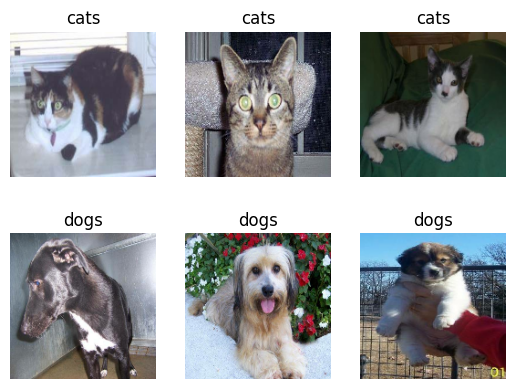
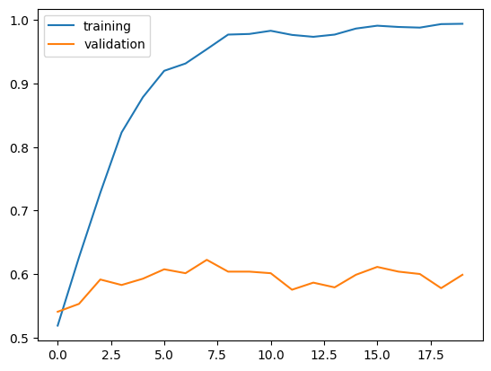
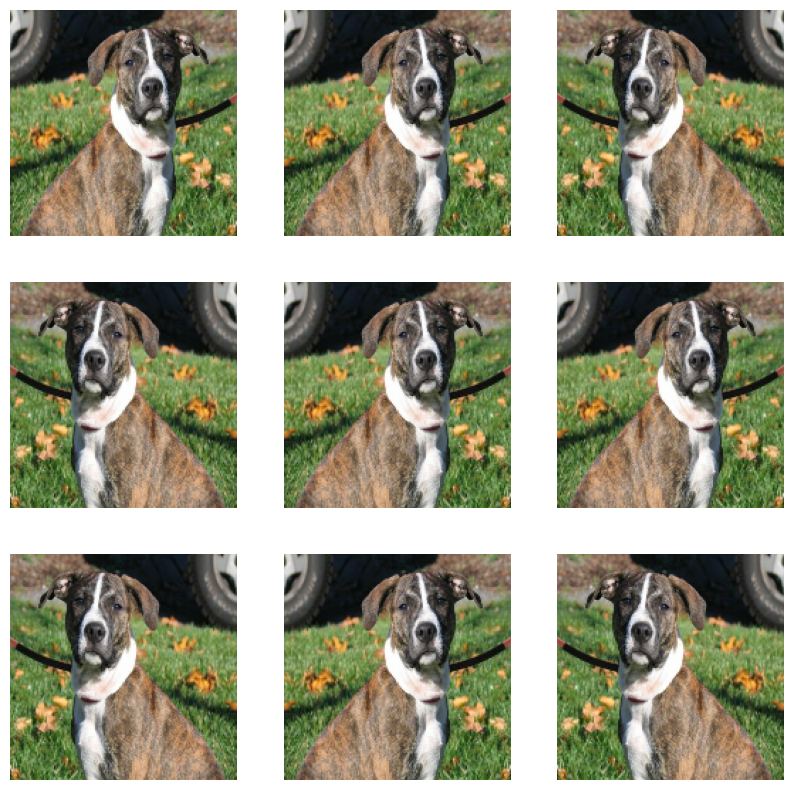
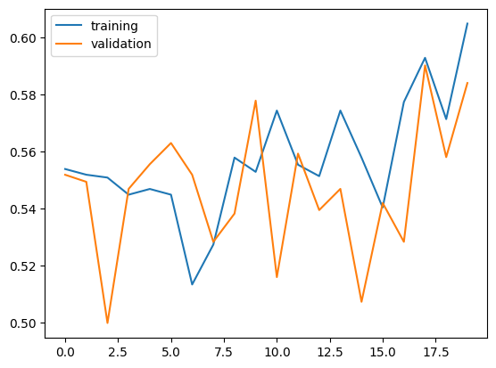
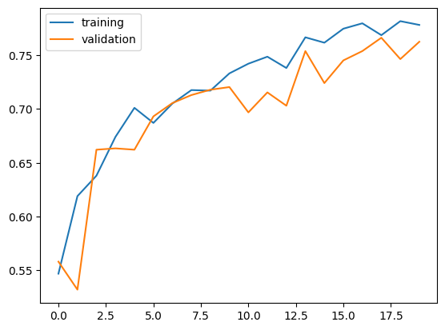
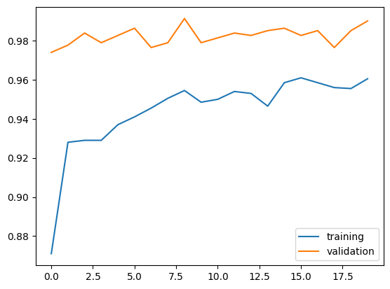
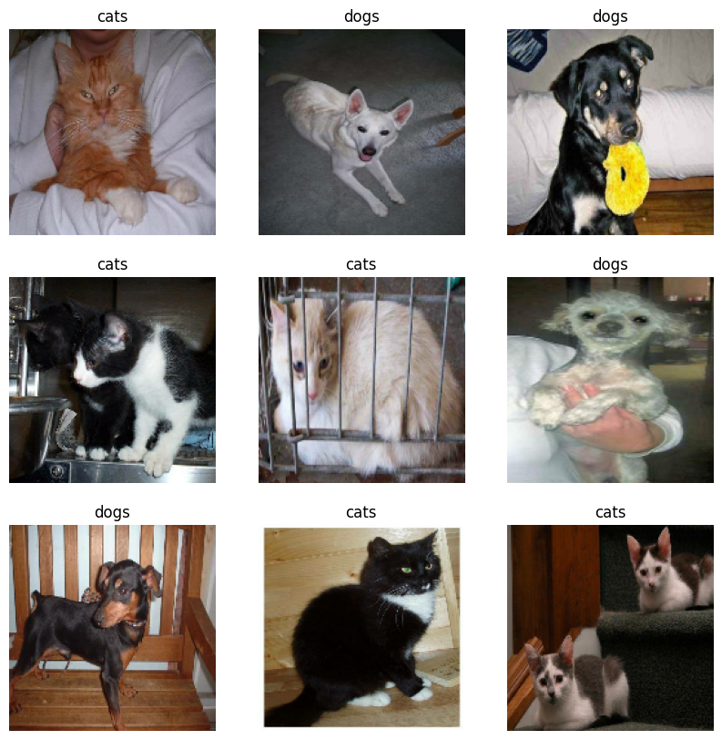

# Overview
*Can you teach a machine learning algorithm to distinguish between pictures of dogs and pictures of cats?*

In this blog post, you will learn several new skills and concepts related to image classification in **Tensorflow.**


Following on the coding portion of the Blog Post in **Google Colab** is strongly recommended. When training your model, **enabling a GPU runtime (under Runtime -> Change Runtime Type)** is likely to lead to significant speed benefits.

# Acknowledgment
Major parts of this Blog Post assignment, including several code chunks, are based on the TensorFlow Transfer Learning Tutorial. You may find that consulting this tutorial is helpful while completing this assignment, although this shouldn’t be necessary.

# Load Packages and Obtain Data
Start by making a code block in which you’ll hold your import statements. 


```python
import matplotlib.pyplot as plt
import numpy as np
import os
import tensorflow as tf
from tensorflow.keras import utils, datasets, layers, models
```


Now, let’s access the data. We’ll use a sample data set provided by the TensorFlow team that contains labeled images of cats and dogs.


```python

# location of data
_URL = 'https://storage.googleapis.com/mledu-datasets/cats_and_dogs_filtered.zip'

# download the data and extract it
path_to_zip = utils.get_file('cats_and_dogs.zip', origin=_URL, extract=True)

# construct paths
PATH = os.path.join(os.path.dirname(path_to_zip), 'cats_and_dogs_filtered')

train_dir = os.path.join(PATH, 'train')
validation_dir = os.path.join(PATH, 'validation')

# parameters for datasets
BATCH_SIZE = 32
IMG_SIZE = (160, 160)

# construct train and validation datasets 
train_dataset = utils.image_dataset_from_directory(train_dir,
                                                   shuffle=True,
                                                   batch_size=BATCH_SIZE,
                                                   image_size=IMG_SIZE)

validation_dataset = utils.image_dataset_from_directory(validation_dir,
                                                        shuffle=True,
                                                        batch_size=BATCH_SIZE,
                                                        image_size=IMG_SIZE)

# construct the test dataset by taking every 5th observation out of the validation dataset
val_batches = tf.data.experimental.cardinality(validation_dataset)
test_dataset = validation_dataset.take(val_batches // 5)
validation_dataset = validation_dataset.skip(val_batches // 5)
```

    Downloading data from https://storage.googleapis.com/mledu-datasets/cats_and_dogs_filtered.zip
    68606236/68606236 [==============================] - 2s 0us/step
    Found 2000 files belonging to 2 classes.
    Found 1000 files belonging to 2 classes.


By running this code, we have created TensorFlow **Datasets** for training, validation, and testing. You can think of a **Dataset** as a pipeline that feeds data to a machine learning model. We use data sets in cases in which it’s not necessarily practical to load all the data into memory.

In our case, we used a special-purpose **keras** utility called **image_dataset_from_directory** to construct a **Dataset**. The most important argument is the first one, which says where the images are located. The **shuffle** argument says that, when retrieving data from this directory, the order should be randomized. The **batch_size** determines how many data points are gathered from the directory at once. Here, for example, each time we request some data we will get 32 images from each of the data sets. Finally, the **image_size** specifies the size of the input images, just like you’d expect.

Finally, the following code block is technical code related to rapidly reading data. If you’re interested in learning more about this kind of thing, you can take a look [here](https://www.tensorflow.org/guide/data_performance).


```python
# Technical code related to rapidly reading data
AUTOTUNE = tf.data.AUTOTUNE
train_dataset = train_dataset.prefetch(buffer_size=AUTOTUNE)
validation_dataset = validation_dataset.prefetch(buffer_size=AUTOTUNE)
test_dataset = test_dataset.prefetch(buffer_size=AUTOTUNE)
```

## Working with Datasets

Let’s briefly explore our data set. by **writing a function to create a two-row visualization.** In the first row, show three random pictures of cats. In the second row, show three random pictures of dogs. You can see some related code in the linked tutorial above, although you’ll need to make some modifications in order to separate cats and dogs by rows. A docstring is not required.


```python
def two_row_visualization(train_dataset):
  # Write a function to create a two-row visualization.
  class_names = ['cats','dogs']

  plt.figure()
  for images, labels in train_dataset.take(1):
    # First row, show three random pictures of cats
    for i in range(3):
      ax = plt.subplot(2, 3, i + 1)
      plt.imshow(images[labels == 0][i].numpy().astype("uint8"))
      plt.title(class_names[0])
      plt.axis("off")
    # Second row, show three random pictures of dogs
    for i in range(3,6):
      ax = plt.subplot(2, 3, i + 1)
      plt.imshow(images[labels ==1][i].numpy().astype("uint8"))
      plt.title(class_names[1])
      plt.axis("off")
```


```python
two_row_visualization(train_dataset)
```


    

    


## Check Label Frequencies


```python
 labels_iterator= train_dataset.unbatch().map(lambda image, label: label).as_numpy_iterator()
```


```python
# Compute the number of images in the training data 
cats = 0 
dogs = 0 
for n in  labels_iterator:
    if n == 0: 
      cats +=1
    else:
      dogs +=1
print(f"There are {cats} cats and {dogs} dogs")
```

    There are 1000 cats and 1000 dogs


The **baseline machine** learning model is the model that always guesses the most frequent label. Here, we have equal frequency of both classes. Regardles of which label we choose, we will get the same result. Thus our baseline freqency will be 50%. 

# First Model

Now we create a tf.keras.Sequential model using some of the commonly used layers. In each model, we will include at least two Conv2D layers, at least two MaxPooling2D layers, at least one Flatten layer, at least one Dense layer, and at least one Dropout layer.


```python
model1=models.Sequential([
    # First Model
    layers.Conv2D(32,(3,3), activation='relu',input_shape=(160,160,3)),
    layers.MaxPooling2D((2,2)),
    layers.Conv2D(32,(3,3), activation='relu'),
    layers.MaxPooling2D((2,2)),
    layers.Conv2D(32,(3,3), activation='relu'),
    layers.MaxPooling2D((2,2)),
    layers.Flatten(),
    layers.Dense(128,activation='relu'),
    layers.Dropout(0.2),
    layers.Dense(1,activation='sigmoid')
])
```


```python
model1.summary()
```

    Model: "sequential"
    _________________________________________________________________
     Layer (type)                Output Shape              Param #   
    =================================================================
     conv2d (Conv2D)             (None, 158, 158, 32)      896       
                                                                     
     max_pooling2d (MaxPooling2D  (None, 79, 79, 32)       0         
     )                                                               
                                                                     
     conv2d_1 (Conv2D)           (None, 77, 77, 32)        9248      
                                                                     
     max_pooling2d_1 (MaxPooling  (None, 38, 38, 32)       0         
     2D)                                                             
                                                                     
     conv2d_2 (Conv2D)           (None, 36, 36, 32)        9248      
                                                                     
     max_pooling2d_2 (MaxPooling  (None, 18, 18, 32)       0         
     2D)                                                             
                                                                     
     flatten (Flatten)           (None, 10368)             0         
                                                                     
     dense (Dense)               (None, 128)               1327232   
                                                                     
     dropout (Dropout)           (None, 128)               0         
                                                                     
     dense_1 (Dense)             (None, 1)                 129       
                                                                     
    =================================================================
    Total params: 1,346,753
    Trainable params: 1,346,753
    Non-trainable params: 0
    _________________________________________________________________


## Train Model 1


```python
model1.compile(optimizer="adam",
              loss=tf.keras.losses.BinaryCrossentropy(from_logits=True),
              metrics=["accuracy"])
```


```python
history1 = model1.fit(train_dataset,
                    epochs=20, 
                    validation_data = validation_dataset)
```

    Epoch 1/20


    /usr/local/lib/python3.10/dist-packages/keras/backend.py:5703: UserWarning: "`binary_crossentropy` received `from_logits=True`, but the `output` argument was produced by a Sigmoid activation and thus does not represent logits. Was this intended?
      output, from_logits = _get_logits(


    63/63 [==============================] - 15s 58ms/step - loss: 15.2528 - accuracy: 0.5190 - val_loss: 0.6917 - val_accuracy: 0.5408
    Epoch 2/20
    63/63 [==============================] - 6s 97ms/step - loss: 0.6485 - accuracy: 0.6265 - val_loss: 0.6844 - val_accuracy: 0.5532
    Epoch 3/20
    63/63 [==============================] - 6s 99ms/step - loss: 0.5287 - accuracy: 0.7280 - val_loss: 0.7088 - val_accuracy: 0.5916
    Epoch 4/20
    63/63 [==============================] - 4s 56ms/step - loss: 0.3755 - accuracy: 0.8230 - val_loss: 0.8449 - val_accuracy: 0.5829
    Epoch 5/20
    63/63 [==============================] - 4s 66ms/step - loss: 0.2679 - accuracy: 0.8785 - val_loss: 0.8719 - val_accuracy: 0.5928
    Epoch 6/20
    63/63 [==============================] - 3s 49ms/step - loss: 0.1988 - accuracy: 0.9200 - val_loss: 1.0356 - val_accuracy: 0.6077
    Epoch 7/20
    63/63 [==============================] - 3s 48ms/step - loss: 0.1845 - accuracy: 0.9315 - val_loss: 1.2159 - val_accuracy: 0.6015
    Epoch 8/20
    63/63 [==============================] - 5s 72ms/step - loss: 0.1200 - accuracy: 0.9540 - val_loss: 1.1853 - val_accuracy: 0.6225
    Epoch 9/20
    63/63 [==============================] - 3s 48ms/step - loss: 0.0762 - accuracy: 0.9770 - val_loss: 1.2808 - val_accuracy: 0.6040
    Epoch 10/20
    63/63 [==============================] - 3s 49ms/step - loss: 0.0723 - accuracy: 0.9780 - val_loss: 1.5834 - val_accuracy: 0.6040
    Epoch 11/20
    63/63 [==============================] - 4s 65ms/step - loss: 0.0530 - accuracy: 0.9830 - val_loss: 1.5954 - val_accuracy: 0.6015
    Epoch 12/20
    63/63 [==============================] - 4s 60ms/step - loss: 0.0764 - accuracy: 0.9765 - val_loss: 2.0710 - val_accuracy: 0.5755
    Epoch 13/20
    63/63 [==============================] - 4s 56ms/step - loss: 0.0846 - accuracy: 0.9735 - val_loss: 2.0212 - val_accuracy: 0.5866
    Epoch 14/20
    63/63 [==============================] - 4s 61ms/step - loss: 0.0683 - accuracy: 0.9770 - val_loss: 1.7919 - val_accuracy: 0.5792
    Epoch 15/20
    63/63 [==============================] - 3s 49ms/step - loss: 0.0597 - accuracy: 0.9865 - val_loss: 1.8418 - val_accuracy: 0.5990
    Epoch 16/20
    63/63 [==============================] - 7s 110ms/step - loss: 0.0474 - accuracy: 0.9910 - val_loss: 1.8392 - val_accuracy: 0.6114
    Epoch 17/20
    63/63 [==============================] - 5s 78ms/step - loss: 0.0366 - accuracy: 0.9890 - val_loss: 1.8615 - val_accuracy: 0.6040
    Epoch 18/20
    63/63 [==============================] - 6s 88ms/step - loss: 0.0416 - accuracy: 0.9880 - val_loss: 2.4103 - val_accuracy: 0.6002
    Epoch 19/20
    63/63 [==============================] - 6s 83ms/step - loss: 0.0253 - accuracy: 0.9935 - val_loss: 2.6146 - val_accuracy: 0.5780
    Epoch 20/20
    63/63 [==============================] - 3s 49ms/step - loss: 0.0230 - accuracy: 0.9940 - val_loss: 2.0030 - val_accuracy: 0.5990


## Visualize the training history


```python
plt.plot(history1.history["accuracy"],label='training')
plt.plot(history1.history["val_accuracy"],label='validation')
plt.legend()
```


    <matplotlib.legend.Legend at 0x7f4a01d84790>


    

    


## Observation on Model 1

The validation accuracy of my model stabilized between 55% and 60% during training. We do not see much fluctuation of validation accuracy during training, unlike the training accuracy.

We did slightly better (10%) than the baseline performance (50%). Which is a good news, but there is much room for improvement.

We definetly see overfitting since the training accuracy is much higher than the validation accuracy after training.

# Model 2 : with Data Augmentation

Now we’re going to add some data augmentation layers to your model. Data augmentation refers to the practice of including modified copies of the same image in the training set. For example, a picture of a cat is still a picture of a cat even if we flip it upside down or rotate it 90 degrees. We can include such transformed versions of the image in our training process in order to help our model learn so-called invariant features of our input images.

### Random Flip Demonstration


```python
RF = tf.keras.Sequential([
  layers.RandomFlip('horizontal'),
])

for image, _ in train_dataset.take(1):
  plt.figure(figsize=(10, 10))
  first_image = image[0]
  for i in range(9):
    ax = plt.subplot(3, 3, i + 1)
    augmented_image = RF(tf.expand_dims(first_image, 0))
    plt.imshow(augmented_image[0] / 255)
    plt.axis('off')

```


    

    


### Random Rotation Demonstration


```python
RR = tf.keras.Sequential([
  layers.RandomRotation(0.2),
])

for image, _ in train_dataset.take(1):
  plt.figure(figsize=(10, 10))
  first_image = image[0]
  for i in range(9):
    ax = plt.subplot(3, 3, i + 1)
    augmented_image = RR(tf.expand_dims(first_image, 0))
    plt.imshow(augmented_image[0] / 255)
    plt.axis('off')

```


    

    


```python
model2=models.Sequential([
    # Data Augmentation Layers 
    layers.RandomFlip('horizontal'),
    layers.RandomRotation(0.2),

    # First Model
    layers.Conv2D(32,(3,3), activation='relu',input_shape=(160,160,3)),
    layers.MaxPooling2D((2,2)),
    layers.Conv2D(32,(3,3), activation='relu'),
    layers.MaxPooling2D((2,2)),
    layers.Conv2D(32,(3,3), activation='relu'),
    layers.MaxPooling2D((2,2)),
    layers.Flatten(),
    layers.Dense(128,activation='relu'),
    layers.Dropout(0.2),
    layers.Dense(1,activation='sigmoid')
])
```

## Train Model 2


```python
model2.compile(optimizer="adam",
              loss=tf.keras.losses.BinaryCrossentropy(from_logits=True),
              metrics=["accuracy"])
```


```python
history2 = model2.fit(train_dataset,
                    epochs=20, 
                    validation_data = validation_dataset)
```

    Epoch 1/20
    63/63 [==============================] - 7s 71ms/step - loss: 3.5202 - accuracy: 0.5540 - val_loss: 0.6864 - val_accuracy: 0.5520
    Epoch 2/20
    63/63 [==============================] - 3s 50ms/step - loss: 0.6838 - accuracy: 0.5520 - val_loss: 0.6805 - val_accuracy: 0.5495
    Epoch 3/20
    63/63 [==============================] - 3s 51ms/step - loss: 0.6889 - accuracy: 0.5510 - val_loss: 0.6998 - val_accuracy: 0.5000
    Epoch 4/20
    63/63 [==============================] - 5s 72ms/step - loss: 0.6911 - accuracy: 0.5450 - val_loss: 0.6934 - val_accuracy: 0.5470
    Epoch 5/20
    63/63 [==============================] - 3s 51ms/step - loss: 0.6881 - accuracy: 0.5470 - val_loss: 0.6975 - val_accuracy: 0.5557
    Epoch 6/20
    63/63 [==============================] - 3s 50ms/step - loss: 0.6872 - accuracy: 0.5450 - val_loss: 0.6902 - val_accuracy: 0.5631
    Epoch 7/20
    63/63 [==============================] - 5s 71ms/step - loss: 0.6911 - accuracy: 0.5135 - val_loss: 0.6888 - val_accuracy: 0.5520
    Epoch 8/20
    63/63 [==============================] - 3s 49ms/step - loss: 0.6829 - accuracy: 0.5275 - val_loss: 0.6888 - val_accuracy: 0.5285
    Epoch 9/20
    63/63 [==============================] - 4s 54ms/step - loss: 0.6837 - accuracy: 0.5580 - val_loss: 0.6860 - val_accuracy: 0.5384
    Epoch 10/20
    63/63 [==============================] - 3s 51ms/step - loss: 0.6839 - accuracy: 0.5530 - val_loss: 0.6885 - val_accuracy: 0.5780
    Epoch 11/20
    63/63 [==============================] - 3s 49ms/step - loss: 0.6751 - accuracy: 0.5745 - val_loss: 0.7076 - val_accuracy: 0.5161
    Epoch 12/20
    63/63 [==============================] - 3s 52ms/step - loss: 0.6812 - accuracy: 0.5555 - val_loss: 0.6902 - val_accuracy: 0.5594
    Epoch 13/20
    63/63 [==============================] - 3s 51ms/step - loss: 0.6824 - accuracy: 0.5515 - val_loss: 0.6965 - val_accuracy: 0.5396
    Epoch 14/20
    63/63 [==============================] - 3s 50ms/step - loss: 0.6761 - accuracy: 0.5745 - val_loss: 0.6883 - val_accuracy: 0.5470
    Epoch 15/20
    63/63 [==============================] - 5s 76ms/step - loss: 0.6837 - accuracy: 0.5580 - val_loss: 0.6886 - val_accuracy: 0.5074
    Epoch 16/20
    63/63 [==============================] - 4s 51ms/step - loss: 0.6825 - accuracy: 0.5405 - val_loss: 0.6910 - val_accuracy: 0.5421
    Epoch 17/20
    63/63 [==============================] - 3s 49ms/step - loss: 0.6779 - accuracy: 0.5775 - val_loss: 0.6927 - val_accuracy: 0.5285
    Epoch 18/20
    63/63 [==============================] - 4s 54ms/step - loss: 0.6637 - accuracy: 0.5930 - val_loss: 0.6920 - val_accuracy: 0.5903
    Epoch 19/20
    63/63 [==============================] - 5s 75ms/step - loss: 0.6719 - accuracy: 0.5715 - val_loss: 0.6973 - val_accuracy: 0.5582
    Epoch 20/20
    63/63 [==============================] - 5s 72ms/step - loss: 0.6667 - accuracy: 0.6050 - val_loss: 0.6803 - val_accuracy: 0.5842


## Visualize the training history


```python
plt.plot(history2.history["accuracy"],label='training')
plt.plot(history2.history["val_accuracy"],label='validation')
plt.legend()
```


    <matplotlib.legend.Legend at 0x7f4a0118bd90>


    

    


## Observation on Model 2

Our validation accuracy of model2  fluctuated alot (50%~65%), but generally improved during training, obtaining near 60% after 20 epochs.

The validation accuracy is not much different than what we observed in model1. But the behavior was much different, since model1's validation accuracy stayed relatively stable accross training.

We don't see overfitting in model2. Unlike in model1, we see a general tendency of accuracy scores are in line with one other (training accuracy is not much higher than the validation accuracy). we can expect to see better validation accuarcy as training accuracy improves

# Model 3 : with Data Preprocessing

Sometimes, it can be helpful to make simple transformations to the input data. For example, in this case, the original data has pixels with RGB values between 0 and 255, but many models will train faster with RGB values normalized between 0 and 1, or possibly between -1 and 1. These are mathematically identical situations, since we can always just scale the weights. But if we handle the scaling prior to the training process, we can spend more of our training energy handling actual signal in the data and less energy having the weights adjust to the data scale.

The following code will create a preprocessing layer called preprocessor which you can slot into your model pipeline.


```python
# Create a preprocessing layer 
i = tf.keras.Input(shape=(160, 160, 3))
x = tf.keras.applications.mobilenet_v2.preprocess_input(i)
preprocessor = tf.keras.Model(inputs = [i], outputs = [x])
```


```python
model3=models.Sequential([
    # Preprocessor Layer
    preprocessor,

    # Data Augmentation Layers 
    layers.RandomFlip('horizontal'),
    layers.RandomRotation(0.2),

    # First Model
    layers.Conv2D(32,(3,3), activation='relu',input_shape=(160,160,3)),
    layers.MaxPooling2D((2,2)),
    layers.Conv2D(32,(3,3), activation='relu'),
    layers.MaxPooling2D((2,2)),
    layers.Conv2D(32,(3,3), activation='relu'),
    layers.MaxPooling2D((2,2)),
    layers.Flatten(),
    layers.Dense(128,activation='relu'),
    layers.Dropout(0.2),
    layers.Dense(1,activation='sigmoid')
])
```

## Train Model 3


```python
model3.compile(optimizer="adam",
              loss=tf.keras.losses.BinaryCrossentropy(from_logits=True),
              metrics=["accuracy"])
```


```python
history3 = model3.fit(train_dataset,
                    epochs=20, 
                    validation_data = validation_dataset)
```

    Epoch 1/20
    63/63 [==============================] - 7s 68ms/step - loss: 0.7037 - accuracy: 0.5470 - val_loss: 0.6805 - val_accuracy: 0.5582
    Epoch 2/20
    63/63 [==============================] - 6s 84ms/step - loss: 0.6568 - accuracy: 0.6190 - val_loss: 0.7627 - val_accuracy: 0.5322
    Epoch 3/20
    63/63 [==============================] - 3s 50ms/step - loss: 0.6335 - accuracy: 0.6380 - val_loss: 0.6106 - val_accuracy: 0.6621
    Epoch 4/20
    63/63 [==============================] - 6s 87ms/step - loss: 0.6017 - accuracy: 0.6740 - val_loss: 0.5905 - val_accuracy: 0.6634
    Epoch 5/20
    63/63 [==============================] - 3s 50ms/step - loss: 0.5827 - accuracy: 0.7010 - val_loss: 0.5961 - val_accuracy: 0.6621
    Epoch 6/20
    63/63 [==============================] - 4s 60ms/step - loss: 0.5789 - accuracy: 0.6870 - val_loss: 0.5737 - val_accuracy: 0.6931
    Epoch 7/20
    63/63 [==============================] - 5s 75ms/step - loss: 0.5676 - accuracy: 0.7050 - val_loss: 0.5732 - val_accuracy: 0.7054
    Epoch 8/20
    63/63 [==============================] - 3s 50ms/step - loss: 0.5535 - accuracy: 0.7175 - val_loss: 0.5547 - val_accuracy: 0.7129
    Epoch 9/20
    63/63 [==============================] - 3s 49ms/step - loss: 0.5418 - accuracy: 0.7170 - val_loss: 0.5537 - val_accuracy: 0.7178
    Epoch 10/20
    63/63 [==============================] - 4s 58ms/step - loss: 0.5271 - accuracy: 0.7330 - val_loss: 0.5510 - val_accuracy: 0.7203
    Epoch 11/20
    63/63 [==============================] - 3s 50ms/step - loss: 0.5325 - accuracy: 0.7420 - val_loss: 0.5798 - val_accuracy: 0.6968
    Epoch 12/20
    63/63 [==============================] - 3s 50ms/step - loss: 0.5255 - accuracy: 0.7485 - val_loss: 0.5711 - val_accuracy: 0.7153
    Epoch 13/20
    63/63 [==============================] - 5s 76ms/step - loss: 0.5094 - accuracy: 0.7380 - val_loss: 0.5841 - val_accuracy: 0.7030
    Epoch 14/20
    63/63 [==============================] - 3s 50ms/step - loss: 0.4989 - accuracy: 0.7665 - val_loss: 0.5128 - val_accuracy: 0.7537
    Epoch 15/20
    63/63 [==============================] - 3s 49ms/step - loss: 0.4904 - accuracy: 0.7615 - val_loss: 0.5432 - val_accuracy: 0.7240
    Epoch 16/20
    63/63 [==============================] - 5s 69ms/step - loss: 0.4788 - accuracy: 0.7745 - val_loss: 0.5266 - val_accuracy: 0.7450
    Epoch 17/20
    63/63 [==============================] - 3s 50ms/step - loss: 0.4801 - accuracy: 0.7795 - val_loss: 0.5105 - val_accuracy: 0.7537
    Epoch 18/20
    63/63 [==============================] - 3s 49ms/step - loss: 0.4649 - accuracy: 0.7685 - val_loss: 0.5098 - val_accuracy: 0.7661
    Epoch 19/20
    63/63 [==============================] - 5s 69ms/step - loss: 0.4603 - accuracy: 0.7815 - val_loss: 0.5161 - val_accuracy: 0.7463
    Epoch 20/20
    63/63 [==============================] - 3s 50ms/step - loss: 0.4532 - accuracy: 0.7780 - val_loss: 0.4950 - val_accuracy: 0.7624


```python
plt.plot(history3.history["accuracy"],label='training')
plt.plot(history3.history["val_accuracy"],label='validation')
plt.legend()
```


    <matplotlib.legend.Legend at 0x7f4a0103b8e0>


    

    


## Observation on Model 3

The validation accuracy of model3 stabilized between 70% and 75% during training. This was the best performance we got so far. Also the validation accuracy was in line with training accuracy.

The validation accuracy is much better (over 10% improvement) than what we observed in model1. And again, the behavior was much different, since model1's validation accuracy stayed relatively stable accross training.

Again, we don't see overfitting in model3. We see a general tendency of accuracy scores are in line with one other (training accuracy is not much higher than the validation accuracy. we can expect to see better validation accuarcy as training accuracy improves


# Model 4 : Transfer Learning
So far, we’ve been training models for distinguishing between cats and dogs from scratch. In some cases, however, someone might already have trained a model that does a related task, and might have learned some relevant patterns. For example, folks train machine learning models for a variety of image recognition tasks. Maybe we could use a pre-existing model for our task?

To do this, we need to first access a pre-existing “base model”, incorporate it into a full model for our current task, and then train that model. Here, we will download "MobileNetV2" and configure it as a layer that can be included in our model.


```python
IMG_SHAPE = IMG_SIZE + (3,)
base_model = tf.keras.applications.MobileNetV2(input_shape=IMG_SHAPE,
                                               include_top=False,
                                               weights='imagenet')
base_model.trainable = False

i = tf.keras.Input(shape=IMG_SHAPE)
x = base_model(i, training = False)
base_model_layer = tf.keras.Model(inputs = [i], outputs = [x])
```

    Downloading data from https://storage.googleapis.com/tensorflow/keras-applications/mobilenet_v2/mobilenet_v2_weights_tf_dim_ordering_tf_kernels_1.0_160_no_top.h5
    9406464/9406464 [==============================] - 1s 0us/step


```python
model4=models.Sequential([
    # Preprocessor Layer
    preprocessor,

    # Data Augmentation Layers 
    layers.RandomFlip('horizontal'),
    layers.RandomRotation(0.2),

    # Base Model Layer
    base_model_layer,

    # Few Additional Layers
    layers.GlobalMaxPooling2D(),
    layers.Dropout(0.2),


    # First Model
    layers.Dense(128,activation='relu'),
    layers.Dropout(0.2),
    layers.Dense(1,activation='sigmoid')
])
```

## Check  model.summary() 
there is a LOT of complexity hidden in the base_model_layer


```python
model4.summary()
```

    Model: "sequential_4"
    _________________________________________________________________
     Layer (type)                Output Shape              Param #   
    =================================================================
     model (Functional)          (None, 160, 160, 3)       0         
                                                                     
     random_flip_4 (RandomFlip)  (None, 160, 160, 3)       0         
                                                                     
     random_rotation_4 (RandomRo  (None, 160, 160, 3)      0         
     tation)                                                         
                                                                     
     model_1 (Functional)        (None, 5, 5, 1280)        2257984   
                                                                     
     global_max_pooling2d (Globa  (None, 1280)             0         
     lMaxPooling2D)                                                  
                                                                     
     dropout_3 (Dropout)         (None, 1280)              0         
                                                                     
     dense_6 (Dense)             (None, 128)               163968    
                                                                     
     dropout_4 (Dropout)         (None, 128)               0         
                                                                     
     dense_7 (Dense)             (None, 1)                 129       
                                                                     
    =================================================================
    Total params: 2,422,081
    Trainable params: 164,097
    Non-trainable params: 2,257,984
    _________________________________________________________________


## Train Model 4


```python
model4.compile(optimizer="adam",
              loss=tf.keras.losses.BinaryCrossentropy(from_logits=True),
              metrics=["accuracy"])
```


```python
history4 = model4.fit(train_dataset,
                    epochs=20, 
                    validation_data = validation_dataset)
```

    Epoch 1/20


    /usr/local/lib/python3.10/dist-packages/keras/backend.py:5703: UserWarning: "`binary_crossentropy` received `from_logits=True`, but the `output` argument was produced by a Sigmoid activation and thus does not represent logits. Was this intended?
      output, from_logits = _get_logits(


    63/63 [==============================] - 12s 109ms/step - loss: 0.5041 - accuracy: 0.8710 - val_loss: 0.0661 - val_accuracy: 0.9740
    Epoch 2/20
    63/63 [==============================] - 5s 81ms/step - loss: 0.1812 - accuracy: 0.9280 - val_loss: 0.0592 - val_accuracy: 0.9777
    Epoch 3/20
    63/63 [==============================] - 4s 55ms/step - loss: 0.1741 - accuracy: 0.9290 - val_loss: 0.0517 - val_accuracy: 0.9839
    Epoch 4/20
    63/63 [==============================] - 5s 76ms/step - loss: 0.1803 - accuracy: 0.9290 - val_loss: 0.0517 - val_accuracy: 0.9790
    Epoch 5/20
    63/63 [==============================] - 4s 56ms/step - loss: 0.1518 - accuracy: 0.9370 - val_loss: 0.0511 - val_accuracy: 0.9827
    Epoch 6/20
    63/63 [==============================] - 4s 55ms/step - loss: 0.1399 - accuracy: 0.9410 - val_loss: 0.0417 - val_accuracy: 0.9864
    Epoch 7/20
    63/63 [==============================] - 5s 75ms/step - loss: 0.1333 - accuracy: 0.9455 - val_loss: 0.0597 - val_accuracy: 0.9765
    Epoch 8/20
    63/63 [==============================] - 4s 56ms/step - loss: 0.1254 - accuracy: 0.9505 - val_loss: 0.0533 - val_accuracy: 0.9790
    Epoch 9/20
    63/63 [==============================] - 4s 56ms/step - loss: 0.1101 - accuracy: 0.9545 - val_loss: 0.0359 - val_accuracy: 0.9913
    Epoch 10/20
    63/63 [==============================] - 5s 74ms/step - loss: 0.1256 - accuracy: 0.9485 - val_loss: 0.0571 - val_accuracy: 0.9790
    Epoch 11/20
    63/63 [==============================] - 4s 55ms/step - loss: 0.1182 - accuracy: 0.9500 - val_loss: 0.0445 - val_accuracy: 0.9814
    Epoch 12/20
    63/63 [==============================] - 4s 56ms/step - loss: 0.1129 - accuracy: 0.9540 - val_loss: 0.0468 - val_accuracy: 0.9839
    Epoch 13/20
    63/63 [==============================] - 5s 73ms/step - loss: 0.1071 - accuracy: 0.9530 - val_loss: 0.0532 - val_accuracy: 0.9827
    Epoch 14/20
    63/63 [==============================] - 7s 102ms/step - loss: 0.1266 - accuracy: 0.9465 - val_loss: 0.0443 - val_accuracy: 0.9851
    Epoch 15/20
    63/63 [==============================] - 5s 70ms/step - loss: 0.0990 - accuracy: 0.9585 - val_loss: 0.0397 - val_accuracy: 0.9864
    Epoch 16/20
    63/63 [==============================] - 6s 85ms/step - loss: 0.1090 - accuracy: 0.9610 - val_loss: 0.0452 - val_accuracy: 0.9827
    Epoch 17/20
    63/63 [==============================] - 5s 73ms/step - loss: 0.1060 - accuracy: 0.9585 - val_loss: 0.0374 - val_accuracy: 0.9851
    Epoch 18/20
    63/63 [==============================] - 4s 61ms/step - loss: 0.1009 - accuracy: 0.9560 - val_loss: 0.0490 - val_accuracy: 0.9765
    Epoch 19/20
    63/63 [==============================] - 4s 64ms/step - loss: 0.1115 - accuracy: 0.9555 - val_loss: 0.0368 - val_accuracy: 0.9851
    Epoch 20/20
    63/63 [==============================] - 8s 111ms/step - loss: 0.1018 - accuracy: 0.9605 - val_loss: 0.0359 - val_accuracy: 0.9901


## Visualize the training history


```python
plt.plot(history4.history["accuracy"],label='training')
plt.plot(history4.history["val_accuracy"],label='validation')
plt.legend()
```


    <matplotlib.legend.Legend at 0x7f4970422a10>


    

    


## Observation on Model 4

The validation accuracy of model4 stabilized between 97% and 99% during training. This was the best performance we got so far. Infact, the validation accuracy outperformed training accuracy. Interestingly, validation accuracy was high from the very begining of training

The validation accuracy is much better (over 20% improvement) than what we observed in model3. And the behavior was much different, since model3's validation accuracy increased as training happend, but model4's accuracy was relatively stable and very high from early training.

There is no evidence of overfitting in model4. Infact, validation accuracy was much higher than the training accuracy from the very begining


# Score on Test Data
Further playing around with model structure did not improved the performance much further than we got with model4 (99% validation accuracy). 
Thus, we finally apply model4 to the test data.


## Evaluation and Prediction


```python
loss, accuracy = model4.evaluate(test_dataset)
print('Test accuracy :', accuracy)
```

    6/6 [==============================] - 0s 38ms/step - loss: 0.0264 - accuracy: 0.9948
    Test accuracy : 0.9947916865348816


```python
# Retrieve a batch of images from the test set
image_batch, label_batch = test_dataset.as_numpy_iterator().next()
predictions = model4.predict_on_batch(image_batch).flatten()

# Apply a sigmoid since our model returns logits
predictions = tf.where(predictions < 0.5, 0, 1)

print('Predictions:\n', predictions.numpy())
print('Labels:\n', label_batch)

plt.figure(figsize=(10, 10))
for i in range(9):
  ax = plt.subplot(3, 3, i + 1)
  plt.imshow(image_batch[i].astype("uint8"))
  plt.title(class_names[predictions[i]])
  plt.axis("off")
```

    Predictions:
     [0 1 1 0 0 1 1 0 0 0 0 0 1 1 0 0 1 1 0 1 0 0 0 0 0 1 0 1 1 0 1 1]
    Labels:
     [0 1 1 0 0 1 1 0 0 0 0 0 1 1 0 0 1 1 0 1 0 0 0 1 0 1 0 1 1 0 1 1]


    

    


## Observation

As we see in evaluation, we got test accuracy of 0.9947916865348816.
Which is very accurate and in line with the validation score from model4. 

We also see in the visualization, that model is indeed good at predicting the class of an image. 

