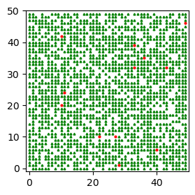
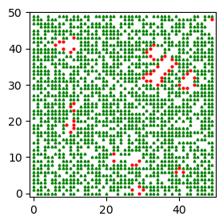
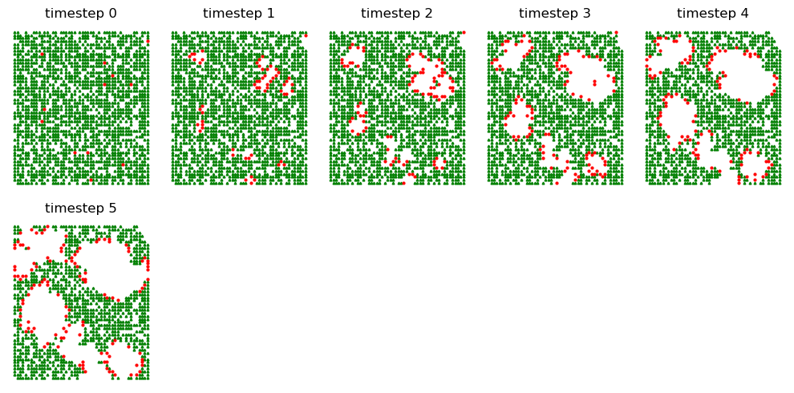
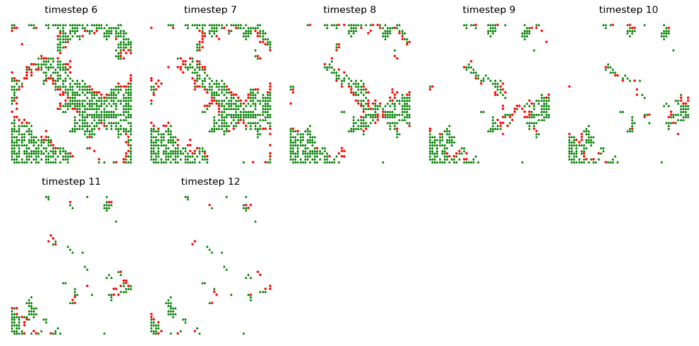
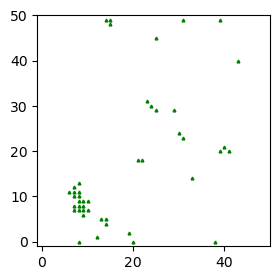
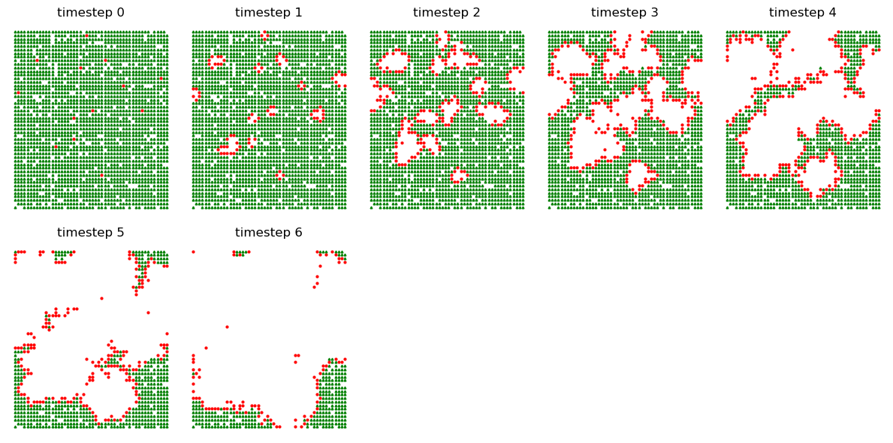
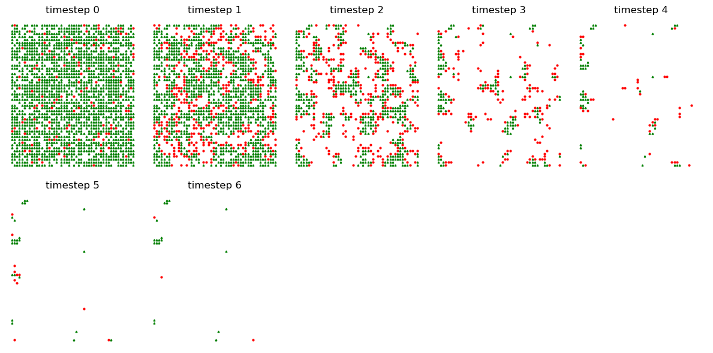
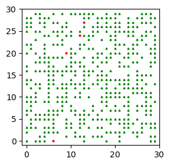

### The goal of this simulation is to implement the Forest Fire Model using an objected oriented approach using Mesa Agent.

We will do the following:

- Create a `FireAgent` class. The fire agent should have two methods `__init__` and `step`.   

    - The `__init__` method should have four parameters, self, pos, value, and model. The pos parameter should represent the position of the agent on the grid. The value parameter should represent 'clear', 'tree', or 'on fire' by 0,1, and 2. The `step` method should input one parameter, self, and it should evolve the fire according to the same rules as in the lecture, e.g., if the current state is `on fire`, then at the next time step it should go to clear.

- Create a `FireModel` class with five methods `__init__`, `step`, `summarize`, `show_snapshot`, and `show_hist`.
    - The `__init__` method should take in five parameters, self, width, height, fire_density, and tree_density. Width and height are the dimensions of the board. fire_density and tree_density are the approximate fractions of fire squares and tree squares. Your method should for loop over the board and place an agent at each spot (so if your board is $N\times N$ you should have $N^2$ agents). Choose each agents values to be 0, 1, or 2 randomly where the probability of a fire square is `fire_density`, and the probability of tree is `tree density`. Your init method should also create an instance variable `self.history`. This variable should be a list, which at initialization has length one. The single item in `self.history` (at this step) should be a numpy array consisting of 0's, 1's, and 2's representing the state of the board.  
    - The `step` method should have one parameter, self, and should move the model one step forward in time similar to the segregation model done in class. It should also append a numpy array describing the current state of the board to the list self.history.
    - The `summarize` method should have two parameters, `self` and `time`. It should output a tuple of length three giving the percentage of 0's, 1's and 2's at the specified time. The time parameter should have a default value of ` "all" `. If time is equal to all, summarize should return a list of tuples describing the state of the forest at all time steps so far. 
    - The `show_snapshot` method should have three parameters, `self`, `time`, and `ax`. It should display the state of the forest, in a plot similar to lecture, at the sepcified time and on the specified axis.
    - The `show_hist` method should take three parameters, `self`, `start`, and `stop`. It should use `subplots` to display the state of the forest between the specified start and stop times (inclusive). For full credit, you show_hist method should call your show_snapshot method. 


### Import Libraries


```python
from mesa import Model, Agent
from mesa.time import RandomActivation
from mesa.space import SingleGrid
import numpy as np
import matplotlib.pyplot as plt
```

To learn more about Mesa: Agent-Based modeling, read the following: 
https://mesa.readthedocs.io/en/stable/

### Define Helper Functions 


```python
def count_val(Model, Value):
    '''
    Helper function for Stopping condition (When there is no fire to spread)
    Count number of Agents with a given value in a given model.
    '''
    count = 0
    for FireAgent in Model.schedule.agents:
        if FireAgent.value == Value:
            count += 1
    return count
    
def grid_to_array(Model):
    '''
    Helper function for Fire Model
    mesa.space has a grid, which is different from np.array
    we need to convert the grid to np.array to store log history
    
    Arg: 
        Model: Model which grid will be converted to numpy array
    '''
    grid = np.array(Model.grid._grid)
    log = np.zeros(grid.shape)

    for i in range(grid.shape[0]):
        for j in range(grid.shape[1]):
            if grid[i,j] is not None: 
                if grid[i,j].value == 1:
                    log[i,j] = 1
                elif grid[i,j].value == 2:
                    log[i,j] = 2
            else: 
                log[i,j] = 0
                
    return log # returns np.array
```

### Define Fire Agent Class


```python
class FireAgent(Agent):
    '''
    FireAgent of FireModel
    inherits from mesa.Agent
    
    Attributes:
        pos: Grid coordinates
        value: Can be 0:clear 1:Tree 2:Fire
        model: Inherit model 
    '''
    
    def __init__(self,pos,value,model):
        '''
        Create a new Agent.
        
        Parameter:
            pos: The Agent's coordinates on the grid
            model: Inherit model 
            value: Can be 0:clear 1:Tree 2:Fire
        '''
        super().__init__(pos,model)   
        self.pos = pos
        self.value = value 
        
    def step(self): 
        '''
        We progress the model (spreading fire) with .step method
        If the tree is on fire(2), spread it to normal(1) trees nearby.
        If the current state is on fire (2), then at the next time step it should go to clear (0).
        '''
        if self.value == 2:
            neighbors = self.model.grid.get_neighbors(self.pos, moore=False)
            for neighbor in neighbors:
                if neighbor.value == 1:
                    neighbor.value = 2
            self.value = 0
    
class FireModel(Model):
    '''
    Simple Fire Model
    inherits from mesa.Agent
    
    Attributes:
        schedule: Schedule to call the step() method of each of the agents in specified sequence.
        grid: The space on which the simulation unfolds.
        history: A list, consisting of numpy arrays of 0's, 1's, and 2's which represnt the state of the board of each timestep.
        running: running property of mesa.model, to halt when there is no fire 
    '''

    def __init__(self,width,height,fire_density,tree_density):
        '''
        Create a new Fire Model.
        
        Parameter:
            height, width: The size of the grid to model
            tree_density: What fraction of grid cells have a tree in them.
            fire_density: What fraction of grid cells have a fire in them.
        '''
        
        # Set up model objects
        self.schedule = RandomActivation(self) # Agents will be activated in random order
        self.grid = SingleGrid(width,height,torus=False) 
        self.history = [] # array to keep the log history
        
        # Initialize FireAgents 
        for cell in self.grid.coord_iter():
            x=cell[1]
            y=cell[2]
            
            # Random assignment according to probability (density)
            random_agent_val = np.random.choice(3,p=[1-fire_density-tree_density,tree_density,fire_density])
            agent = FireAgent(pos=(x,y),value = random_agent_val ,model=self)
            self.schedule.add(agent)
            self.grid.position_agent(agent,x,y)
        
        # Convert Model.grid to np.array
        log = grid_to_array(self)
        
        # Append to self.history
        self.history.append(log)
       
        # Model running live 
        self.running = True

        
    def step(self):
        '''
        Advance the model by one step.
        '''
        # Advance each agents by one step according to schedule.
        self.schedule.step()
        
        # Convert the current Model.grid status to np.array
        log = grid_to_array(self)
        
        # Append to self.history
        self.history.append(log)
        
        # Stop if no more fire
        if count_val(self,2) == 0:
            self.running = False
    
    def summarize(self,time="all"):   
        '''
        Output a tuple of length three giving the percentage of 0's, 1's and 2's at the specified time.
        
        Parameter: 
            time: Specified time. Default value of "all", which returns a list of tuples describing the state of the forest at all time steps.
            '''
        if time == "all":
            l = []
            for log in FM.history: 
                # Count occurrence of each values 
                unique, counts = np.unique(log, return_counts=True)
                
                # Convert to Percentage
                arr = counts/sum(counts)*100
                t = tuple(arr.round(2))
                l.append(t)
            return l 
        
        else: 
            # Archieve Time in history
            log = FM.history[time]   
            
            # Count occurrence of each values 
            unique, counts = np.unique(log, return_counts=True)
            
            # Convert to Percentage
            arr = counts/sum(counts)*100
            t = tuple(arr.round(2))
            return t 
    
    def show_snapshot(self,time,ax):
        '''
        display the state of the forest at the sepcified time and on the specified axis.
        
        Parameter:
            time: sepcified time
            ax: specified axis
        '''
        # Archieve Time in history
        log = self.history[time]
        x_range=np.arange(log.shape[1])
        y_range=np.arange(log.shape[0])

        # Initialize Mesh Grid 
        x_indices,y_indices=np.meshgrid(x_range,y_range)
        
        # Store x and y indices of values
        tree_x =x_indices[log==1]
        tree_y =y_indices[log==1]
        fire_x =x_indices[log==2]
        fire_y =y_indices[log==2]
        empty_x=x_indices[log==0]
        empty_y=y_indices[log==0]

        plt.xlim([-1,log.shape[1]])
        plt.ylim([-1,log.shape[0]])

        # Plot with according markers 
        ax.plot(empty_x,empty_y,'ws',markersize=2)
        ax.plot(tree_x,tree_y,'g^',markersize=2)
        ax.plot(fire_x,fire_y,'ro',markersize=2)

        
    def show_hist(self,start,stop):
        '''
        Use subplots to display the state of the forest between the specified start and stop times
        calls show_snapshot method for plotting
        
        Parameters:
            start: specified start time
            stop: specified stop time
        '''
        # number of subplots to plot
        num = stop - start 
        
        # Generate subplots 
        fig, axarr = plt.subplots(num//5+1,5, figsize=(num*2,num))
        
        # Plot each subplots
        t = start
        for ax in axarr.flatten(): 
            if t <= stop:
                ax.set(title = f"timestep {t}")
                FM.show_snapshot(t,ax)    
                t += 1
                
            # Turn off axis for better view 
            ax.axis("off")
            
        # Show the plot 
        plt.tight_layout()
        plt.show()
```

# Demostration

## Initialize Model


```python
FM = FireModel(50,50,.005,.7)
```

## Visualize via show_snapshot


```python
# Using show_snapshot
fig, ax = plt.subplots(figsize=(3,3))
FM.show_snapshot(0,ax)
```


    

    


## Show the summary statistic of the timestep


```python
# See the percentage of 0:clear 1:Tree 2:Fire
# default showing all timestep
FM.summarize()
```


    [(29.6, 69.92, 0.48)]


## Simulate Step by Step


```python
# Advance the model one step
FM.step()
```


```python
# Using show_snapshot
fig, ax = plt.subplots(figsize=(3,3))
FM.show_snapshot(1,ax)
```


    

    


```python
# Advance the model
FM.step()
FM.step()
FM.step()
FM.step()
```


```python
# Using show_hist
FM.show_hist(0,5)
```


    

    


## Run the whole model


```python
# Run the whole model until there is no fire
FM.run_model()
```


```python
FM.show_hist(6,12)
```


    

    


```python
# Whole history 
end = len(FM.history) -1
FM.show_hist(0,end)
```


    

    


```python
# See the percentage of 0:clear 1:Tree 2:Fire at the end
FM.summarize(end)
```


    (98.2, 1.8)


```python
# Whole statistics
FM.summarize()
```


    [(29.6, 69.92, 0.48),
     (31.72, 65.96, 2.32),
     (36.84, 59.64, 3.52),
     (43.68, 52.28, 4.04),
     (50.92, 44.76, 4.32),
     (59.32, 35.76, 4.92),
     (66.96, 28.24, 4.8),
     (75.68, 19.64, 4.68),
     (82.76, 14.12, 3.12),
     (87.92, 9.8, 2.28),
     (91.52, 6.92, 1.56),
     (94.16, 4.56, 1.28),
     (96.2, 2.88, 0.92),
     (97.32, 2.28, 0.4),
     (98.08, 1.84, 0.08),
     (98.2, 1.8)]


```python
# Using show_snapshot
fig, ax = plt.subplots(figsize=(3,3))
FM.show_snapshot(end,ax)
```


    

    


# Experiment with different values

## Higher tree density

It seem like the fire spreads more easily when tree density is higher (0.7 → 0.9)

the model stops advancing with fewer timestep


```python
FM = FireModel(50,50,.005,.9)
FM.run_model()
FM.show_hist(0,6)
print("Summary Statistic for the whole timestep (clear, tree, fire)")
print(FM.summarize())
```


    

    


    Summary Statistic for the whole timestep (clear, tree, fire)
    [(8.28, 91.2, 0.52), (10.16, 86.48, 3.36), (18.64, 73.4, 7.96), (35.32, 53.96, 10.72), (54.8, 34.88, 10.32), (72.6, 19.84, 7.56), (84.6, 11.68, 3.72), (90.28, 7.12, 2.6), (94.44, 3.72, 1.84), (96.92, 2.08, 1.0), (98.72, 0.64, 0.64), (99.64, 0.08, 0.28), (99.96, 0.04)]


## Higer Fire density

It seem like the fire also spreads more easily when fire density is higher (0.005 → 0.05)

the model stops advancing with fewer timestep


```python
FM = FireModel(50,50,.05,.7)
FM.run_model()
FM.show_hist(0,6)
print("Summary Statistic for the whole timestep (clear, tree, fire)")
print(FM.summarize())
```


    

    


    Summary Statistic for the whole timestep (clear, tree, fire)
    [(25.92, 69.28, 4.8), (40.84, 43.64, 15.52), (69.08, 18.2, 12.72), (88.28, 5.52, 6.2), (96.44, 1.96, 1.6), (98.6, 0.96, 0.44), (99.12, 0.76, 0.12), (99.24, 0.76)]


## When Density is Both Lower 

When density is both lower, we can observe quite interesting pattern as below. 

Because the density is both low, the forest burns for a longer timestep, slowly spreading

And the single fire almost burned the half of the forest. 

Even simulations are giving us a lesson that we should be also watchful of even small fires. 


```python
FM = FireModel(30,30,.002,.5)
FM.run_model()
fig, ax = plt.subplots(figsize=(3,3))
FM.show_snapshot(0,ax)
print("Summary Statistic for the whole timestep (clear, tree, fire)")
print(FM.summarize())
```

    Summary Statistic for the whole timestep (clear, tree, fire)
    [(49.11, 50.44, 0.44), (50.0, 49.44, 0.56), (50.89, 48.44, 0.67), (52.56, 46.56, 0.89), (54.33, 44.67, 1.0), (55.89, 43.33, 0.78), (56.89, 41.89, 1.22), (58.78, 40.0, 1.22), (60.33, 38.67, 1.0), (61.89, 37.0, 1.11), (63.33, 36.0, 0.67), (64.33, 35.33, 0.33), (64.78, 35.0, 0.22), (65.11, 34.78, 0.11), (65.22, 34.67, 0.11), (65.44, 34.22, 0.33), (65.78, 34.0, 0.22), (66.33, 33.33, 0.33), (67.11, 32.44, 0.44), (67.67, 32.0, 0.33), (68.0, 31.67, 0.33), (68.44, 31.33, 0.22), (68.67, 31.22, 0.11), (68.78, 31.11, 0.11), (68.89, 31.11)]


    

    

