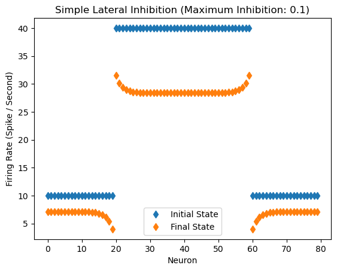
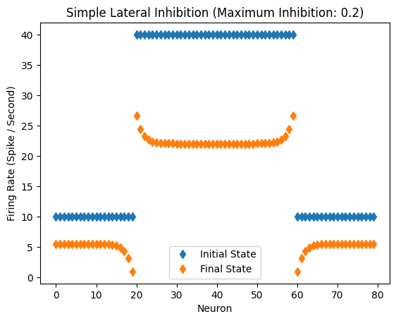
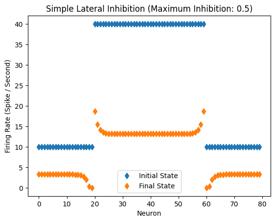
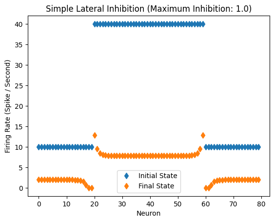
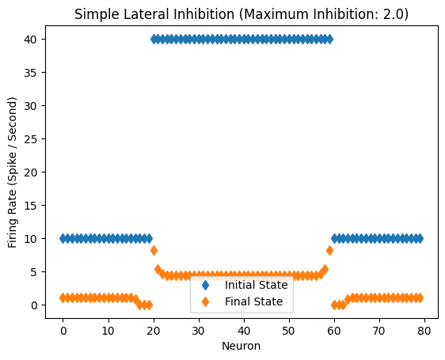
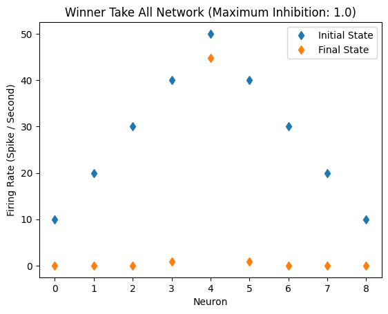
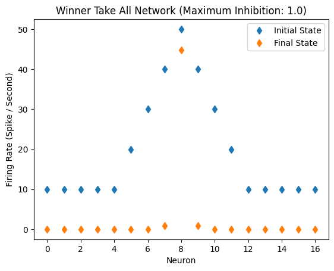
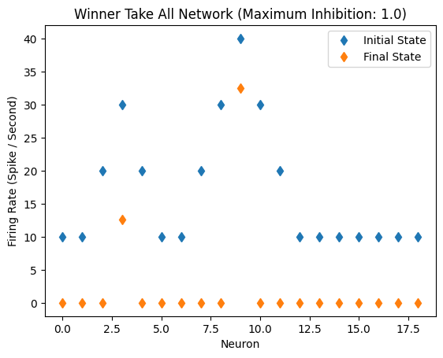

# Preface 
**Lateral inhibition** is a process that occurs in the nervous system, particularly in sensory systems like vision and touch. It refers to the mechanism by which neighboring sensory cells or neurons inhibit or suppress each other's activity.

To understand lateral inhibition, imagine a group of sensory cells arranged in a line. When a stimulus, such as light or pressure, is applied to one of these cells, it becomes activated and sends signals to the brain. However, instead of simply transmitting the signal as it is, the activated cell also sends inhibitory signals to its neighboring cells.

These inhibitory signals serve to reduce the activity of the neighboring cells, making them less likely to send signals to the brain. This inhibition creates a contrast or sharp boundary between the activated cell and its neighbors. As a result, the brain can more accurately determine the location and intensity of the stimulus.

In simple terms, lateral inhibition enhances the contrast between activated sensory cells and their neighbors, allowing for better perception and discrimination of sensory information. It helps to sharpen our perception and make it more accurate by reducing the background noise or blurring that could otherwise occur.

A **winner-takes-all (WTA)** network, also known as a competition network, is a type of neural network architecture where multiple neurons or nodes compete with each other to become the "winner" by having the highest activation level. The winning neuron suppresses the activity of its competitors, causing only one neuron to become active at a time.

To understand this concept, imagine a group of neurons connected to a common set of inputs. Each neuron receives the same input information but has different initial strengths or weights associated with its connections. When the input is presented, each neuron processes the information and produces an output based on its specific weights and activation function.

In a winner-takes-all network, the neuron with the highest output, or the one that responds most strongly to the input, is declared the winner. This winning neuron's output is then significantly boosted, while the outputs of other neurons are suppressed or inhibited. As a result, only the winning neuron contributes to the network's output, while the others remain inactive or have minimal influence.

This mechanism of competition and inhibition helps the network make a clear decision or select the most relevant or salient response among multiple possibilities. Winner-takes-all networks are often used in tasks where a single output or decision is required from a pool of competing options, **such as selecting the strongest visual feature** or identifying the most prominent sound in an auditory scene.

In this post, we are mimicing figures of Lateral Inhibition and Winner Takes All (WTA) network in the book. 

We will be using following parameters:
* Dimensionality = 80 *(there are 80 neurons)*
* Number of Iterations = 50 *(Simulate inhibition 50 times)*
* Upper Limit = 60 *(Maximum Firing Rate of Neurons)*
* Lower Limit = 0 *(Minimum Firing Rate of Neurons)*

# Lateral Inhibition

Code is self explanatory.


```python
import matplotlib.pyplot as plt
import numpy as np 

def Lateral_Inhibition(): 

    # Initialize Parameters from User Input
    max_strength = abs(float(input("Inhibitory Maximum Strength: "))) # Maximum value of inhibition
    length_constant = float(input("Inhibitory Length Constant: ")) # Length constant of inhibition
    epsilon = float(input("Epsilon: ")) # Computational constant

    # Set up Parameters
    dimensionality = 80
    number_of_iterations = 50
    upper_limit = 60
    lower_limit = 0

    # Initialize State Vector
    initial_state_vector = [10] * 20 + [40] * 40 + [10] * 20 # Our input, before inhibition, Start pattern
    state_vector = initial_state_vector # Resulting state_vector after inhibition

    # Initialize Inhibitory Weights
    inhibitory_weights = np.zeros([dimensionality,dimensionality])
    for i in range(dimensionality):
        for j in range(dimensionality):
            inhibitory_weights[i,j] = -max_strength*np.exp(-min(abs(i-j),dimensionality-abs(i-j))/length_constant)

    # Compute Inhibited State Vector
    for i in range(number_of_iterations):
        new_state_vector = []
        for j in range(dimensionality):
            new_value = state_vector[j] + epsilon * (initial_state_vector[j] + np.dot(inhibitory_weights[j], state_vector) - state_vector[j])
            
            # Restrict values to upper and lower limit 
            if new_value < lower_limit: new_value = 0
            if new_value > upper_limit: new_value = 60
            new_state_vector.append(new_value)
        state_vector = new_state_vector

    # Display State Vector 
    plt.plot(initial_state_vector, 'd')
    plt.plot(state_vector, 'd')
    plt.legend(['Initial State', 'Final State'])
    plt.xlabel("Neuron")
    plt.ylabel("Firing Rate (Spike / Second)")
    plt.title("Simple Lateral Inhibition (Maximum Inhibition: {})".format(max_strength))
    plt.show() 
```

## Response of the network with inhibitory coefficient of 0.1


```python
Lateral_Inhibition()
```

    Inhibitory Maximum Strength: 0.1
    Inhibitory Length Constant: 2
    Epsilon: 0.1


    

    


## Response of the network with inhibitory coefficient of 0.2


```python
Lateral_Inhibition()
```

    Inhibitory Maximum Strength: 0.2
    Inhibitory Length Constant: 2
    Epsilon: 0.1


    

    


## Response of the network with inhibitory coefficient of 0.5.


```python
Lateral_Inhibition()
```

    Inhibitory Maximum Strength: 0.5
    Inhibitory Length Constant: 2
    Epsilon: 0.1


    

    


## Response of the network with inhibitory coefficient of 1.0.


```python
Lateral_Inhibition()
```

    Inhibitory Maximum Strength: 1
    Inhibitory Length Constant: 2
    Epsilon: 0.1


    

    


## Response of the network with inhibitory coefficient of 2.0.


```python
Lateral_Inhibition()
```

    Inhibitory Maximum Strength: 2
    Inhibitory Length Constant: 2
    Epsilon: 0.1


    

    


# Winner Take All

So we have now seen simple Lateral Inhibition network. Another interesting network to look at is Winner Take All network. In WTA networks, the desired final state vector has a single active unit, with all the other activity suppressed by lateral inhibition. 

Couple requirements for WTA to work successfully:
1. The **strength of inhibition must be very large** in these systems, because one active cell must have sufficently strong coupling to other members in its group to turn them off completely.
2. The **length constant must be very large** so one unit can strongly inhibit all the other units in the group no matter where they are located. 
3. For a WTA network to function, it is **necessary to remove self-inhibition**. 

To closely view the inhibition effect, I am not going to display the whole set of initial_state_vector as above, but only display(use) the parts of initial_state_vector.

The following code is very similar to Lateral_Inhibition() function from above, just with slight modifications to work as a WTA network.


```python
def WTA(initial_state_vector): 

    # Initialize Parameters from User Input
    max_strength = abs(float(input("Inhibitory Maximum Strength: ")))
    length_constant = float(input("Inhibitory Length Constant: "))
    epsilon = float(input("Epsilon: "))
    dimensionality = len(initial_state_vector)
    
    # Initialize Parameters 
    number_of_iterations = 50
    upper_limit = 60
    lower_limit = 0

    # Initialize State Vector
    state_vector = initial_state_vector

    # Make Inhibitory Weights
    inhibitory_weights = np.zeros([dimensionality,dimensionality])
    for i in range(dimensionality):
        for j in range(dimensionality): 
            if i is not j: # NO Self Inhibition
                inhibitory_weights[i,j] = -max_strength*np.exp(-min(abs(i-j),dimensionality-abs(i-j))/length_constant)
    
    # Compute Inhibited State Vector
    for i in range(number_of_iterations):
        new_state_vector = []
        for j in range(dimensionality):
            new_value = state_vector[j] + epsilon * (initial_state_vector[j] + np.dot(inhibitory_weights[j], state_vector) - state_vector[j])
            # Restrict upper and lower limit 
            if new_value < lower_limit: new_value = 0
            if new_value > upper_limit: new_value = 60
            new_state_vector.append(new_value)
        state_vector = new_state_vector

    # Display State Vector 
    plt.plot(initial_state_vector, 'd')
    plt.plot(state_vector, 'd')
    plt.legend(['Initial State', 'Final State'])
    plt.xlabel("Neuron")
    plt.ylabel("Firing Rate (Spike / Second)")
    plt.title("Winner Take All Network (Maximum Inhibition: {})".format(max_strength))
    plt.show() 
```

## Single Peak, No Bias Light Level

other lights are far apart, not influencing the strongest light


```python
initial_state_vector = [10,20,30,40,50,40,30,20,10]
WTA(initial_state_vector)
```

    Inhibitory Maximum Strength: 1
    Inhibitory Length Constant: 10
    Epsilon: 0.1


    

    


## Single Peak, Bias Light Level

Other lights are closer to strongest light, affecting it

But WTA network still works even with constant light bias 


```python
initial_state_vector = [10,10,10,10,10,20,30,40,50,40,30,20,10,10,10,10,10]
WTA(initial_state_vector)
```

    Inhibitory Maximum Strength: 1
    Inhibitory Length Constant: 10
    Epsilon: 0.1


    

    


## Twin Peaks, Inhibition: 1.0

The WRA network has some trouble handling two peaks. The most active unit in the second peak is not fully suppressed.


```python
initial_state_vector = [10,10,20,30,20,10,10,20,30,40,30,20,10,10,10,10,10,10,10]
WTA(initial_state_vector)
```

    Inhibitory Maximum Strength: 1
    Inhibitory Length Constant: 10
    Epsilon: 0.1


    

    


## Twin Peaks, Inhibition: 2.0

By doubling the amount of inhibition, the second peak (in previous figure) can be suppressed.


```python
initial_state_vector = [10,10,20,30,20,10,10,20,30,40,30,20,10,10,10,10,10,10,10]
WTA(initial_state_vector)
```

    Inhibitory Maximum Strength: 2
    Inhibitory Length Constant: 10
    Epsilon: 0.1


    

    

